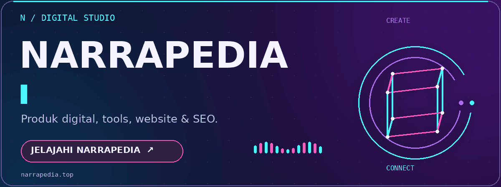
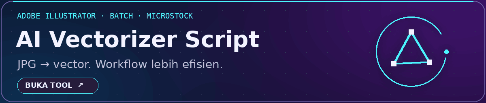
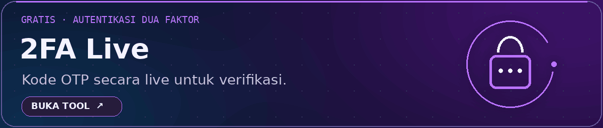
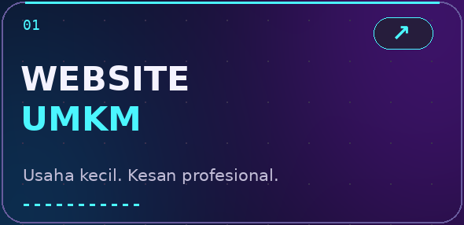
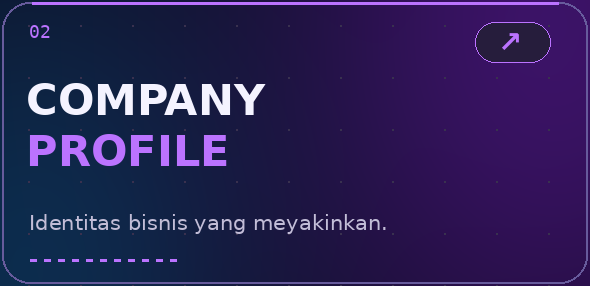
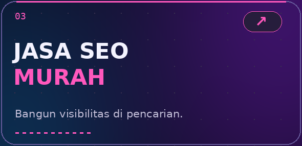
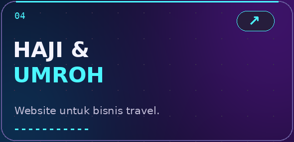
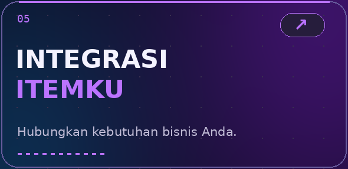
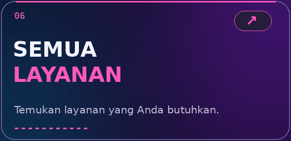

<!-- Profil Narrapedia : folder assets-v2 diperlukan -->

<a href="https://narrapedia.top">Website</a> &nbsp; · &nbsp; <a href="https://narrapedia.top/services">Layanan</a> &nbsp; · &nbsp; <a href="https://narrapedia.top/donate">Donasi</a>

<strong>Detail tools & fitur</strong>

- **[AI Vectorizer Script](https://narrapedia.top/tools/ai-vectorizer-script)** — Tool batch vectorizing untuk mengubah JPG menjadi vector di Adobe Illustrator dengan workflow yang lebih efisien dan lebih siap untuk kebutuhan microstock. Lihat pilihan versi dan akses pada halaman tool.
- **[2FA Live](https://narrapedia.top/tools/2fa-live/)** — Tool autentikasi dua faktor gratis untuk generate dan menampilkan kode OTP secara live bagi kebutuhan verifikasi akun digital.
- **[OutlookReader](https://narrapedia.top/tools/outlook-reader/)** — Pembaca email Outlook dan Hotmail gratis untuk akun yang Anda miliki dan otorisasi, dilengkapi inbox, junk mail, serta brankas lokal terenkripsi.

<strong>Narrapedia</strong> · Indonesia <a href="https://narrapedia.top">narrapedia.top</a>

