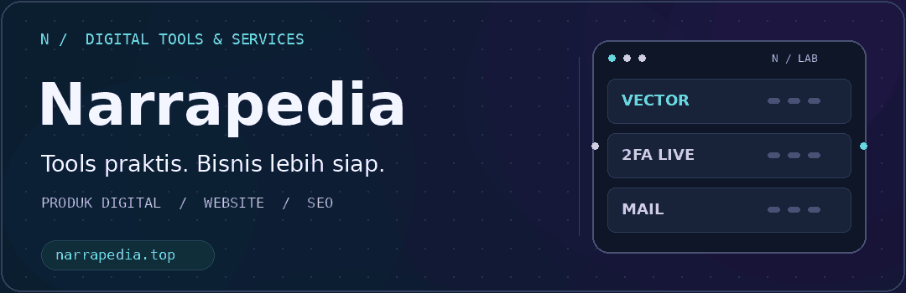
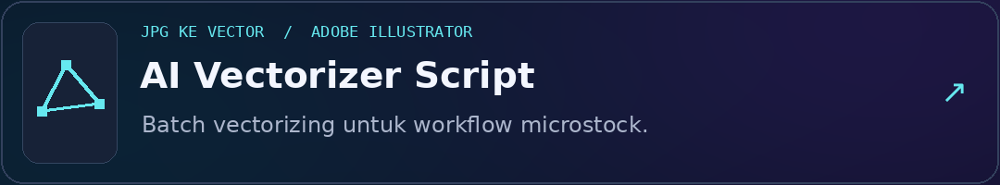
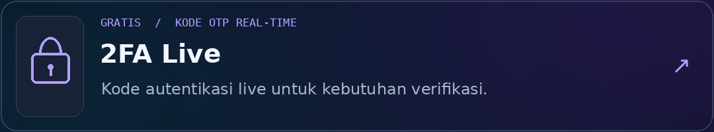
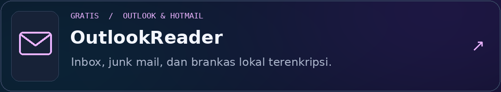
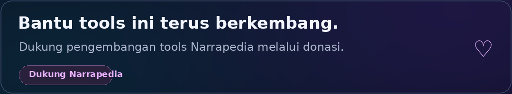

  

<strong>Tools praktis. Website profesional. Bisnis lebih siap.</strong> 
Membantu kreator dan bisnis melalui produk digital, tools, layanan website, dan SEO.

  
  
  

## Tools Narrapedia

Tools untuk workflow kreatif dan kebutuhan akun digital. Pilih tool untuk melihat fitur serta aksesnya.

**[AI Vectorizer Script](https://narrapedia.top/tools/ai-vectorizer-script)** — Tool batch vectorizing untuk mengubah JPG menjadi vector di Adobe Illustrator, dengan workflow yang lebih efisien untuk kebutuhan microstock. Lihat pilihan versi dan akses pada halaman tool.

**[2FA Live](https://narrapedia.top/tools/2fa-live/)** · **Gratis** — Generate dan tampilkan kode OTP secara live untuk kebutuhan verifikasi akun digital.

**[OutlookReader](https://narrapedia.top/tools/outlook-reader/)** · **Gratis** — Pembaca email Outlook dan Hotmail untuk akun yang Anda miliki dan otorisasi. Dilengkapi akses inbox, junk mail, serta brankas lokal terenkripsi.

## Website & SEO untuk Bisnis

Jasa pembuatan website UMKM, company profile, dan SEO dengan pilihan layanan sesuai kebutuhan bisnis.

| Layanan | Fokus |
| :--- | :--- |
| **[Website UMKM](https://narrapedia.top/services/website-umkm)** | Kehadiran online untuk usaha kecil dan menengah. |
| **[Website Company Profile](https://narrapedia.top/services/website-company-profile)** | Profil perusahaan dan informasi layanan bisnis. |
| **[Jasa SEO Murah](https://narrapedia.top/services/jasa-seo-murah)** | Optimasi website untuk visibilitas di pencarian. |
| **[Website Haji & Umroh](https://narrapedia.top/services/website-haji-umroh)** | Website untuk bisnis travel haji dan umroh. |
| **[Integrasi Itemku](https://narrapedia.top/services/integrasi-api-itemku)** | Integrasi API Itemku sesuai kebutuhan bisnis. |

**[Jelajahi semua layanan →](https://narrapedia.top/services)**

## Dukung Pengembangan Tools

Jika tools Narrapedia membantu pekerjaan Anda, dukungan Anda membantu kami melanjutkan pengembangannya.

**[Donasi untuk Narrapedia →](https://narrapedia.top/donate)**

---

<strong>Narrapedia</strong> · Indonesia 
<a href="https://narrapedia.top">narrapedia.top</a> · Tools & layanan untuk kebutuhan digital Anda.

